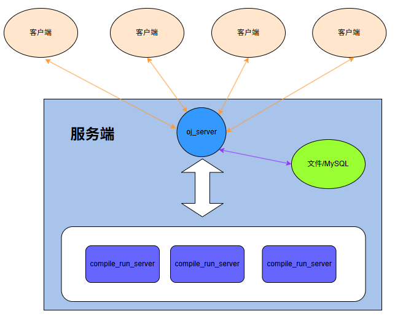
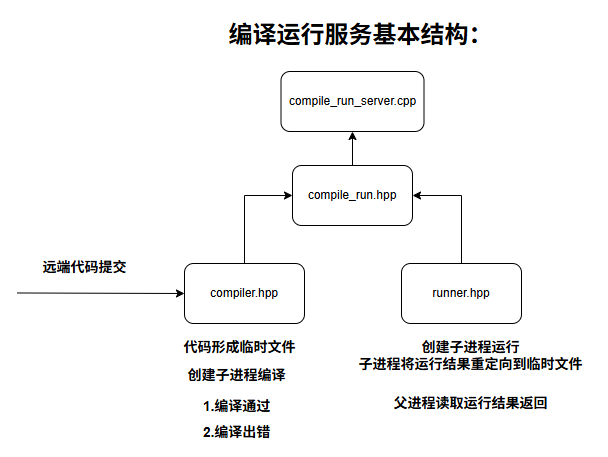
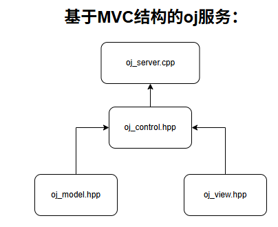

该项目主要模拟实现类似牛客、力扣的刷题功能。

使用技术：
C/C++、Boost准标准库(字符串切割)、cpp-httplib、ctemplate 、jsoncpp 、Ace前端在线编辑器、MySQL、负载均衡设计、多进程、多线程等；

项目的三个核心模块：
1.comm：公共模块
2.oj_sever：负责处理客户端的各种请求。获取题目列表、查看题目、编写题目、负载均衡选择编译服务端等功能
3.compile_sever：负责在后台编译运行题目代码

